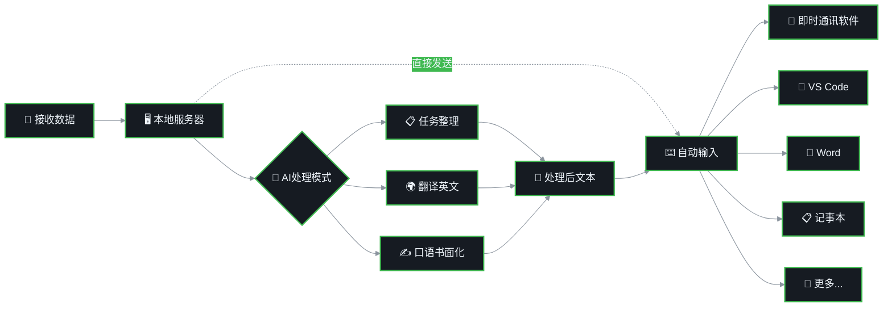

# AIPut 📱

[English](README_en.md) | 中文

通过手机端语音输入实现电脑端远程输入的 AI 增强工具

> 本项目受到 [QAA-Tools/qaa-airtype](https://github.com/QAA-Tools/qaa-airtype) 的启发，并在其基础上进行了功能扩展和改进。

## 📸 效果展示

<div align="center">
  <table>
    <tr>
      <td align="center">
        
        <br><br>
        <strong>服务端运行界面</strong>
        <br><small>一键启动，自动生成二维码</small>
      </td>
      <td align="center">
        
        <br><br>
        <strong>AI智能处理</strong>
        <br><small>实时处理语音输入</small>
      </td>
      <td align="center">
        
        <br><br>
        <strong>口语书面化</strong>
        <br><small>自动将口语转换为规范书面语言</small>
      </td>
      <td align="center">
        
        <br><br>
        <strong>任务整理</strong>
        <br><small>AI自动生成详细任务描述</small>
      </td>
      <td align="center">
        
        <br><br>
        <strong>即时翻译</strong>
        <br><small>中文语音实时转为英文输出</small>
      </td>
    </tr>
  </table>
</div>

## 🔄 交互流程示意图

### 1️⃣ 手机端流程


### 2️⃣ 电脑端处理流程



### 📋 流程说明

- **🖥️ 本地服务器**：运行在用户本机的Flask服务，通过局域网接收手机发送的数据
- **☁️ 云端AI服务**：采用智谱AI、Azure AI、OpenAI或Anthropic AI等第三方平台进行文本处理
- **🎯 目标应用**：支持所有带文本框的应用，包括即时通讯软件（微信、QQ、Telegram）、VS Code、Word、记事本等

## 🌟 核心亮点

### 🎤 高质量中文语音输入 - 豆包输入法推荐

AIPut 充分利用手机端优秀的语音识别能力，实现高效的语音转文字输入。经过实际测试，**强烈推荐使用豆包输入法**进行中文语音输入：

- ✅ **识别准确率极高**：对中文语音的识别准确率领先其他输入法
- ✅ **语义理解能力强**：能够准确理解上下文，减少误识别
- ✅ **标点符号智能添加**：自动识别语句结构，智能添加标点符号
- ✅ **支持多场景输入**：无论是日常对话、专业术语还是长文本输入，都能准确识别

### 🤖 AI 智能提示词处理

AIPut 创新性地引入了基于提示词的中间处理系统，让您的语音输入变得更加智能和高效。内置多种实用提示词：

#### 📋 **任务整理**
将散乱的口语化描述自动整理成条理清晰的任务列表
```
语音输入："帮我写个报告要包括数据分析和图表还有一些结论"
AI 输出：
- 撰写数据分析报告
- 包含数据可视化图表
- 提供结论和建议
```

#### 🌍 **翻译为英文**
实时翻译，实现即时的口译效果
```
语音输入："今天天气很好，我们出去散步吧"
AI 输出："The weather is great today, let's go for a walk"
```

#### ✍️ **口语书面化**
将口语化表达自动转换为规范的书面语言
```
语音输入："这个项目的话呢，我觉得我们需要尽快搞定它"
AI 输出："我认为我们需要尽快完成这个项目"
```

#### 🚀 **勇敢模式**
开启后，文本输入到电脑后会自动发送，无需额外操作
- 启用勇敢模式后，系统会在粘贴文本后自动按下 Ctrl+Enter
- 适合聊天软件、即时通讯等需要快速发送的场景
- 实现真正的"说完即发送"，全程无需电脑操作

## 操作系统兼容性

| 操作系统 | 桌面环境 | 显示协议 | 测试状态 | 备注 |
|---------|---------|---------|---------|------|
| **Windows** | - | - | ✅ 已测试 | 完全支持 (10/11) |
| Fedora | KDE | Wayland | ✅ 已测试 | 完全支持 |
| Fedora | GNOME | Wayland | ⚠️ 未测试 | 预期支持 |
| Fedora | 其他DE | X11 | ⚠️ 未测试 | 预期支持 |
| Ubuntu | GNOME | Wayland/X11 | ⚠️ 未测试 | 预期支持 |
| Arch Linux | 任意DE | Wayland/X11 | ⚠️ 未测试 | 预期支持 |
| Debian | 任意DE | X11 | ⚠️ 未测试 | 预期支持 |
| 其他Linux发行版 | - | - | ❓ 未知 | 需要测试 |
| macOS | - | - | ❌ 未支持 | 需要适配 |

> 💡 **提示**：如果您在其他系统上成功运行，欢迎提交PR更新此表格。

## 快速开始

### 环境要求

- Python 3.8+
- Windows 10/11 或 Linux操作系统（支持X11/Wayland）
- 手机与电脑在同一局域网内
- **推荐**：安装豆包输入法（获得最佳中文语音识别体验）

### 第一步：配置手机输入法（强烈推荐）

在开始之前，请先在手机上安装并配置豆包输入法：

1. 在应用商店搜索"豆包输入法"并安装
2. 在手机设置中将豆包输入法设为默认输入法
3. 开启语音输入权限

**为什么选择豆包输入法？**
- 中文语音识别准确率行业领先
- 自动智能添加标点符号
- 支持各种专业术语和长文本识别
- 与 AIPut 的 AI 处理功能完美配合

### 安装依赖

<details>
<summary>Fedora 系统（推荐）</summary>

```bash
# 1. 安装系统依赖（需要管理员权限）
sudo ./install-fedora-deps.sh

# 2. 创建虚拟环境并安装 Python 依赖
./install-fedora-user.sh

# 3. 启动程序
./run-auto.sh
```

脚本会自动：
- 创建 Python 虚拟环境 (`aiput-env`)
- 安装所需的 Python 包
- 检测运行环境（Wayland/X11、KDE等）
- 运行跨平台版本 (`src/remote_server.py`)

</details>

<details>
<summary>Ubuntu/Debian 系统</summary>

```bash
# 1. 安装系统依赖
sudo apt-get update
sudo apt-get install -y \
    python3 \
    python3-pip \
    python3-tkinter \
    python3-venv \
    python3-dev \
    build-essential \
    xclip \
    xdotool \
    xautomation \
    wl-clipboard \
    wtype

# 2. 创建虚拟环境并安装 Python 依赖
python3 -m venv aiput-env
source aiput-env/bin/activate
pip install --upgrade pip
pip install flask pyautogui pyperclip qrcode[pil] pystray

# 3. 运行程序
source aiput-env/bin/activate
python src/remote_server.py
```

</details>

<details>
<summary>Arch Linux</summary>

```bash
# 1. 安装系统依赖
sudo pacman -S --needed \
    python \
    python-pip \
    python-tkinter \
    python-virtualenv \
    base-devel \
    xclip \
    xdotool \
    xautomation \
    wl-clipboard \
    wtype

# 2. 创建虚拟环境并安装 Python 依赖
python -m venv aiput-env
source aiput-env/bin/activate
pip install --upgrade pip
pip install flask pyautogui pyperclip qrcode[pil] pystray

# 3. 运行程序
source aiput-env/bin/activate
python src/remote_server.py
```

</details>

<details>
<summary>其他Linux发行版</summary>

```bash
# 1. 安装基础依赖（根据包管理器调整）
# - Python 3.8+ 和 venv
# - 开发工具（gcc, make 等）
# - X11/Wayland 开发库
# - 键盘模拟工具：xdotool (X11), wtype (Wayland)
# - 剪贴板工具：xclip/xsel (X11), wl-copy (Wayland)

# 2. 创建虚拟环境并安装 Python 依赖
python3 -m venv aiput-env
source aiput-env/bin/activate
pip install --upgrade pip
pip install flask pyautogui pyperclip qrcode[pil] pystray

# 3. 运行程序
source aiput-env/bin/activate
python src/remote_server.py
```

</details>

<details>
<summary>Windows 系统</summary>

```cmd
REM 1. 创建虚拟环境
python -m venv aiput-env

REM 2. 激活虚拟环境
aiput-env\Scripts\activate

REM 3. 安装依赖
pip install flask[async] pyautogui pyperclip qrcode pillow pystray aiohttp python-dotenv

REM 4. 运行程序
python src\remote_server.py
```

或者在 PowerShell 中：

```powershell
# 1. 创建虚拟环境
python -m venv aiput-env

# 2. 激活虚拟环境
.\aiput-env\Scripts\Activate.ps1

# 3. 安装依赖
pip install flask[async] pyautogui pyperclip qrcode pillow pystray aiohttp python-dotenv

# 4. 运行程序
python src\remote_server.py
```

**一键启动脚本：**

安装完依赖后，只需双击 `run-auto.bat` 即可启动程序。

</details>

### 运行程序

成功运行后，您将看到：
1. 系统托盘图标
2. 二维码（手机扫描访问）
3. 服务器IP地址和端口

> 💡 **提示**：
> - **Windows**: 双击 `run-auto.bat` 即可启动
> - **Linux**: 使用 `./run-auto.sh` 启动，会自动检测您的环境（Wayland/X11、桌面环境等）
> - 主程序位于 `src/remote_server.py`，这是一个跨平台版本

## AI 功能配置

### 获取 API Key

#### 智谱AI（首选方案）

**推荐订阅方式：CodePlan 优惠订阅**
为有效降低使用成本，推荐通过 CodePlan 订阅智谱API服务，可享受专属折扣优惠：
👉 **立即订阅（享专属折扣）**：[https://www.bigmodel.cn/claude-code?ic=14BY54APZA](https://www.bigmodel.cn/claude-code?ic=14BY54APZA)

**获取 API Key 步骤：**
1. 访问 [智谱AI开放平台](https://open.bigmodel.cn/)
2. 注册并登录账号
3. 进入 API Key 管理页面，创建新的 API Key
4. 复制 API Key 供后续配置使用

### 配置 API Key

#### 方法一：环境变量（推荐）

```bash
# 创建 .env 文件
cp .env.example .env

# 编辑 .env 文件，添加您的 API Key
nano .env
```

编辑 `.env` 文件，将 `your_zai_api_key_here` 替换为您的实际 API Key：

```bash
# 智谱AI API 配置
ZAI_API_KEY=your_actual_zai_api_key
ZAI_API_BASE_URL=https://open.bigmodel.cn/api/anthropic
ZAI_MODEL=glm-4.6

# AI 处理器设置
AI_PROCESSOR_DEFAULT=zai
AI_PROCESSING_TIMEOUT=30
```

**配置说明：**
- `ZAI_API_KEY`: 智谱AI API密钥（从智谱开放平台获取）
- `ZAI_API_BASE_URL`: 智谱AI API的基础URL（已预配置，无需修改）
- `ZAI_MODEL`: 使用的智谱AI模型（默认：glm-4.6，推荐版本）
- `AI_PROCESSOR_TIMEOUT`: AI处理超时时间（秒）
- `AI_PROCESSOR_DEFAULT`: 默认的AI处理器（设置为zai）

> 💡 **提示**：
> - `.env` 文件会被 `python-dotenv` 自动加载，确保它位于项目根目录
> - 如果未安装 `python-dotenv`，系统将使用系统环境变量
> - 配置已与项目默认设置保持一致，通常只需填写 API Key 即可

#### 方法二：系统环境变量

```bash
# 使用智谱AI
export ZAI_API_KEY=your_actual_zai_api_key
export AI_PROCESSOR_DEFAULT=zai

# 永久设置（添加到 ~/.bashrc 或 ~/.zshrc）
echo 'export ZAI_API_KEY=your_actual_zai_api_key' >> ~/.bashrc
echo 'export AI_PROCESSOR_DEFAULT=zai' >> ~/.bashrc
source ~/.bashrc
```


## 使用方法

1. **启动程序**：
   - **Windows**: 双击 `run-auto.bat` 或运行 `python src\remote_server.py`
   - **Linux**: `./run-auto.sh` 或激活虚拟环境后运行 `python src/remote_server.py`

2. **配置手机输入法（重要）**：
   - **强烈推荐安装豆包输入法**
   - 在手机键盘设置中选择豆包输入法
   - 开启语音输入权限

3. **扫描二维码**：使用手机浏览器扫描程序显示的二维码

4. **选择提示词模式**：
   - **无提示词**：直接输入，不进行处理
   - **任务整理**：自动整理成条理清晰的任务列表
   - **内容翻译为英文**：实时翻译，实现口译效果
   - **口语书面化**：将口语转换为规范的书面表达

5. **开始语音输入**：
   - 点击语音输入按钮（使用豆包输入法）
   - 清晰地说出您的内容
   - 豆包输入法会自动识别并添加标点
   - 识别的文字会自动填入输入框

6. **AI 智能处理**：
   - 如果选择了提示词模式，AI 会自动处理您的输入
   - 例如选择"任务整理"，会自动转换为结构化的任务列表
   - 例如选择"翻译为英文"，会实时翻译为英文

7. **自动发送**：处理后的文字会自动发送到电脑并输入到当前焦点程序

8. **查看历史**：
   - 点击左上角菜单按钮
   - 查看最近的输入记录
   - 点击历史记录可快速重发

## 工作原理

1. **服务器端**（电脑）：
   - 运行Flask HTTP服务器
   - 生成连接二维码供手机扫描
   - 接收手机发送的文字
   - 使用系统工具模拟键盘输入

2. **客户端**（手机）：
   - 浏览器访问本地Web界面
   - 大尺寸文本框输入文字
   - 支持多行文本输入
   - 通过手势或按钮发送文字

## 常见问题

### 无法输入文字？
- 确保已安装必要的系统工具（xdotool/wtype）
- Wayland用户可能需要配置权限
- 确保目标应用程序可以接收键盘输入

### 连接超时？
- 确保手机和电脑在同一局域网
- 检查防火墙设置
- 尝试使用IP地址直接访问


## 致谢

本项目受到 [QAA-Tools/qaa-airtype](https://github.com/QAA-Tools/qaa-airtype) 的启发，并在其基础上进行了移动端界面优化和功能改进。

## 贡献

欢迎提交Issue和Pull Request！

## 链接

- [GitHub仓库](https://github.com/newbe36524/AIPut)
- [问题反馈](https://github.com/newbe36524/AIPut/issues)

## 🎉 特别推荐：智谱 GLM Coding 订阅

🚀 **本仓库全程使用智谱AI辅助开发！强烈推荐订阅！**

速来拼好模，智谱 GLM Coding 超值订阅，邀你一起薅羊毛！本仓库就是使用 Claude Code（智谱平台版）进行开发的，体验极佳！

**为什么选择智谱 GLM Coding：**
- ✅ 本仓库 proof：全程使用智谱AI开发，效率提升300%！
- ✅ 完整支持 Claude Code、Cline 等 10+ 顶级编程工具
- ✅ 超值订阅，每月仅 $3 起
- ✅ **通过下方链接订阅，立享10%折扣！**
- ✅ 稳定可靠的 API 服务，国内访问速度快
- ✅ 专属中文技术支持

🔥 **限时优惠**：立即开拼，享限时惊喜价！

👉 **立即订阅（享10%折扣）**：[https://www.bigmodel.cn/claude-code?ic=14BY54APZA](https://www.bigmodel.cn/claude-code?ic=14BY54APZA)

> 💡 **提示**：通过该链接订阅，您不仅可以获得10%的折扣，还能支持本项目的持续开发！

