# AIPut 📱

English | [中文](README.md)

An AI-enhanced tool that enables remote input to your computer through mobile voice input.

> This project is inspired by [QAA-Tools/qaa-airtype](https://github.com/QAA-Tools/qaa-airtype) and has been extended with additional features and improvements.

## 📸 Demo Screenshots

<div align="center">
  <table>
    <tr>
      <td align="center">
        
        <br><br>
        <strong>Server Interface</strong>
        <br><small>One-click launch, auto-generate QR code</small>
      </td>
      <td align="center">
        
        <br><br>
        <strong>AI Processing</strong>
        <br><small>Real-time voice input processing</small>
      </td>
      <td align="center">
        
        <br><br>
        <strong>Spoken to Written</strong>
        <br><small>Auto-convert spoken to formal written language</small>
      </td>
      <td align="center">
        
        <br><br>
        <strong>Task Organization</strong>
        <br><small>AI auto-generates detailed task descriptions</small>
      </td>
      <td align="center">
        
        <br><br>
        <strong>Real-time Translation</strong>
        <br><small>Instant Chinese to English voice translation</small>
      </td>
    </tr>
  </table>
</div>

## 🔄 Interaction Flow Diagram

### 1️⃣ Mobile End Flow


### 2️⃣ Computer End Processing Flow

```mermaid
%%{init: {
  'theme': 'base',
  'themeVariables': {
    'primaryColor': '#0d1117',
    'primaryTextColor': '#f0f6fc',
    'primaryBorderColor': '#30363d',
    'lineColor': '#8b949e',
    'sectionBkgColor': '#161b22',
    'altSectionBkgColor': '#0d1117',
    'gridColor': '#30363d',
    'secondaryColor': '#3fb950',
    'tertiaryColor': '#3fb950',
    'background': '#0d1117'
  }
}}%%
flowchart LR
    Receive[📡 Receive Data] --> LocalServer[🖥️ Local Server]

    LocalServer --> AIMode{🤖 AI Processing Mode}
    LocalServer -.->|Direct Send| AutoType[⌨️ Auto Type]

    AIMode --> TaskOrganize[📋 Task Organization]
    AIMode --> TranslateEN[🌍 Translate to English]
    AIMode --> Formalize[✍️ Spoken to Written]

    TaskOrganize --> ProcessedText[📄 Processed Text]
    TranslateEN --> ProcessedText
    Formalize --> ProcessedText

    ProcessedText --> AutoType

    AutoType --> IM[💬 Instant Messaging]
    AutoType --> VSCode[📝 VS Code]
    AutoType --> Word[📄 Word]
    AutoType --> Notepad[📋 Notepad]
    AutoType --> Others[🔧 More...]

    classDef default fill:#161b22,stroke:#3fb950,stroke-width:2px,color:#f0f6fc
```



### 📋 Flow Description

- **🖥️ Local Server**: Flask service running on the user's local machine, receiving data from mobile devices via LAN
- **☁️ Cloud AI Services**: Utilizing third-party platforms like Zhipu AI, Azure AI, OpenAI, or Anthropic AI for text processing
- **🎯 Target Applications**: Supports all applications with text input fields, including instant messaging software (WeChat, QQ, Telegram), VS Code, Word, Notepad, etc.

## 🌟 Core Highlights

### 🎤 High-Quality Chinese Voice Input - Doubao Input Method Recommended

AIPut leverages the excellent voice recognition capabilities of mobile devices to achieve efficient voice-to-text input. Through extensive testing, we **strongly recommend using Doubao Input Method** for Chinese voice input:

- ✅ **Extremely High Recognition Accuracy**: Leads other input methods in Chinese voice recognition accuracy
- ✅ **Strong Semantic Understanding**: Accurately understands context, reducing misrecognition
- ✅ **Intelligent Punctuation Addition**: Automatically recognizes sentence structure and intelligently adds punctuation
- ✅ **Multi-Scene Support**: Accurately recognizes daily conversations, professional terms, and long text inputs

### 🤖 AI Smart Prompt Processing

AIPut innovatively introduces a prompt-based intermediate processing system that makes your voice input smarter and more efficient. Built-in practical prompts include:

#### 📋 **Task Organization**
Automatically organizes scattered spoken descriptions into clear, structured task lists
```
Voice Input: "Help me write a report that includes data analysis, charts, and some conclusions"
AI Output:
- Write data analysis report
- Include data visualization charts
- Provide conclusions and recommendations
```

#### 🌍 **Translate to English**
Real-time translation for instant interpretation effects
```
Voice Input: "今天天气很好，我们出去散步吧"
AI Output: "The weather is great today, let's go for a walk"
```

#### ✍️ **Spoken to Written Language**
Converts spoken expressions into standard written language
```
Voice Input: "这个项目的话呢，我觉得我们需要尽快搞定它"
AI Output: "I think we need to complete this project as soon as possible"
```

#### 🚀 **Brave Mode**
Once enabled, text will be automatically sent after input to the computer, no additional operations needed
- When Brave Mode is enabled, the system will automatically press Ctrl+Enter after pasting text
- Perfect for chat software, instant messaging, and other scenarios requiring quick sending
- Achieves true "speak and send" functionality without any computer operations

## Operating System Compatibility

| Operating System | Desktop Environment | Display Protocol | Test Status | Notes |
|-----------------|-------------------|------------------|-------------|-------|
| Fedora | KDE | Wayland | ✅ Tested | Fully supported |
| Fedora | GNOME | Wayland | ⚠️ Untested | Expected to work |
| Fedora | Other DE | X11 | ⚠️ Untested | Expected to work |
| Ubuntu | GNOME | Wayland/X11 | ⚠️ Untested | Expected to work |
| Arch Linux | Any DE | Wayland/X11 | ⚠️ Untested | Expected to work |
| Debian | Any DE | X11 | ⚠️ Untested | Expected to work |
| Other Linux Distros | - | - | ❓ Unknown | Testing needed |
| macOS | - | - | ❌ Not Supported | Needs adaptation |
| Windows | - | - | ❌ Not Supported | Needs adaptation |

> 💡 **Tip**: If you successfully run it on other systems, feel free to submit a PR to update this table.

## Quick Start

### Requirements

- Python 3.8+
- Linux OS (supports X11/Wayland)
- Smartphone and computer on the same local network
- **Recommended**: Install Doubao Input Method for optimal Chinese voice recognition experience

### Step 1: Configure Mobile Input Method (Highly Recommended)

Before starting, please install and configure Doubao Input Method on your phone:

1. Search for "Doubao Input Method" in the app store and install it
2. Set Doubao Input Method as the default input method in your phone settings
3. Enable voice input permissions

**Why Choose Doubao Input Method?**
- Industry-leading Chinese voice recognition accuracy
- Automatic intelligent punctuation addition
- Supports various professional terms and long text recognition
- Perfectly integrates with AIPut's AI processing features

### Install Dependencies

<details>
<summary>Fedora System (Recommended)</summary>

```bash
# 1. Install system dependencies (requires admin privileges)
sudo ./install-fedora-deps.sh

# 2. Create virtual environment and install Python dependencies
./install-fedora-user.sh

# 3. Run the program
./run-auto.sh
```

The scripts will automatically:
- Create Python virtual environment (`aiput-env`)
- Install required Python packages
- Detect runtime environment (Wayland/X11, KDE, etc.)
- Run cross-platform version (`src/remote_server.py`)

</details>

<details>
<summary>Ubuntu/Debian Systems</summary>

```bash
# 1. Install system dependencies
sudo apt-get update
sudo apt-get install -y \
    python3 \
    python3-pip \
    python3-tkinter \
    python3-venv \
    python3-dev \
    build-essential \
    xclip \
    xdotool \
    xautomation \
    wl-clipboard \
    wtype

# 2. Create virtual environment and install Python dependencies
python3 -m venv aiput-env
source aiput-env/bin/activate
pip install --upgrade pip
pip install flask pyautogui pyperclip qrcode[pil] pystray

# 3. Run the program
source aiput-env/bin/activate
python src/remote_server.py
```

</details>

<details>
<summary>Arch Linux</summary>

```bash
# 1. Install system dependencies
sudo pacman -S --needed \
    python \
    python-pip \
    python-tkinter \
    python-virtualenv \
    base-devel \
    xclip \
    xdotool \
    xautomation \
    wl-clipboard \
    wtype

# 2. Create virtual environment and install Python dependencies
python -m venv aiput-env
source aiput-env/bin/activate
pip install --upgrade pip
pip install flask pyautogui pyperclip qrcode[pil] pystray

# 3. Run the program
source aiput-env/bin/activate
python src/remote_server.py
```

</details>

<details>
<summary>Other Linux Distributions</summary>

```bash
# 1. Install basic dependencies (adjust according to package manager)
# - Python 3.8+ and venv
# - Development tools (gcc, make, etc.)
# - X11/Wayland development libraries
# - Keyboard simulation tools: xdotool (X11), wtype (Wayland)
# - Clipboard tools: xclip/xsel (X11), wl-copy (Wayland)

# 2. Create virtual environment and install Python dependencies
python3 -m venv aiput-env
source aiput-env/bin/activate
pip install --upgrade pip
pip install flask pyautogui pyperclip qrcode[pil] pystray

# 3. Run the program
source aiput-env/bin/activate
python src/remote_server.py
```

</details>

### Run the Program

After successful execution, you will see:
1. System tray icon
2. QR code (scan with mobile phone to access)
3. Server IP address and port

> 💡 **Tips**:
> - Using the automated scripts on Fedora is recommended for one-click installation and configuration
> - `run-auto.sh` will automatically detect your environment (Wayland/X11, desktop environment, etc.)
> - The main program is located at `src/remote_server.py`, which is a cross-platform version

## AI Function Configuration

### Get API Key

#### Zhipu AI (Preferred Solution)

**Recommended Subscription Method: CodePlan Discount Subscription**
To effectively reduce usage costs, we recommend subscribing to Zhipu AI API services through CodePlan to enjoy exclusive discounts:
👉 **Subscribe Now (Get Exclusive Discount)**: [https://www.bigmodel.cn/dev/app#channel=codeplan](https://www.bigmodel.cn/dev/app#channel=codeplan)

**API Key Acquisition Steps:**
1. Visit [Zhipu AI Open Platform](https://open.bigmodel.cn/)
2. Register and log in to your account
3. Go to API Key management page and create a new API Key
4. Copy the API Key for subsequent configuration

### Configure API Key

#### Method One: Environment Variables (Recommended)

```bash
# Create .env file
cp .env.example .env

# Edit .env file and add your API Key
nano .env
```

Edit the `.env` file, replacing `your_zai_api_key_here` with your actual API Key:

```bash
# Zhipu AI API Configuration
ZAI_API_KEY=your_actual_zai_api_key
ZAI_API_BASE_URL=https://open.bigmodel.cn/api/anthropic
ZAI_MODEL=glm-4.6

# AI Processor Settings
AI_PROCESSOR_DEFAULT=zai
AI_PROCESSING_TIMEOUT=30
```

**Configuration Description:**
- `ZAI_API_KEY`: Zhipu AI API key (get from Zhipu Open Platform)
- `ZAI_API_BASE_URL`: Zhipu AI API base URL (pre-configured, no modification needed)
- `ZAI_MODEL`: Zhipu AI model to use (default: glm-4.6, recommended version)
- `AI_PROCESSOR_TIMEOUT`: AI processing timeout in seconds
- `AI_PROCESSOR_DEFAULT`: Default AI processor (set to zai)

> 💡 **Tips**:
> - `.env` file will be automatically loaded by `python-dotenv`, ensure it's in the project root directory
> - If `python-dotenv` is not installed, the system will use system environment variables
> - Configuration is consistent with project default settings, usually only need to fill in the API Key

#### Method Two: System Environment Variables

```bash
# Use Zhipu AI
export ZAI_API_KEY=your_actual_zai_api_key
export AI_PROCESSOR_DEFAULT=zai

# Permanent settings (add to ~/.bashrc or ~/.zshrc)
echo 'export ZAI_API_KEY=your_actual_zai_api_key' >> ~/.bashrc
echo 'export AI_PROCESSOR_DEFAULT=zai' >> ~/.bashrc
source ~/.bashrc
```

## Usage

1. **Start Program**:
   - Fedora system: `./run-auto.sh`
   - Other systems: Activate virtual environment and run `python src/remote_server.py`

2. **Configure Mobile Input Method (Important)**:
   - **Strongly recommend installing Doubao Input Method**
   - Select Doubao Input Method in phone keyboard settings
   - Enable voice input permissions

3. **Scan QR Code**: Use your phone's browser to scan the QR code displayed by the program

4. **Select Prompt Mode**:
   - **No Prompt**: Direct input without processing
   - **Task Organization**: Automatically organize into clear task lists
   - **Translate to English**: Real-time translation for interpretation effects
   - **Spoken to Written**: Convert spoken language to written expression

5. **Start Voice Input**:
   - Click the voice input button (using Doubao Input Method)
   - Clearly speak your content
   - Doubao Input Method will automatically recognize and add punctuation
   - Recognized text will automatically fill the input box

6. **AI Smart Processing**:
   - If you select a prompt mode, AI will automatically process your input
   - For example, selecting "Task Organization" will automatically convert to structured task lists
   - For example, selecting "Translate to English" will translate in real-time

7. **Auto Send**: Processed text will be automatically sent to the computer and input to the current focused program

8. **View History**:
   - Click the menu button in the top left corner
   - View recent input records
   - Click history records to quickly resend

## How It Works

1. **Server Side** (Computer):
   - Runs Flask HTTP server
   - Generates connection QR code for phone scanning
   - Receives text sent from phone
   - Uses system tools to simulate keyboard input

2. **Client Side** (Phone):
   - Browser accesses local web interface
   - Large text box for text input
   - Supports multi-line text input
   - Sends text through buttons or gestures

## FAQ

### Cannot input text?
- Check if necessary system tools are installed (xdotool/wtype)
- Wayland users may need to configure permissions
- Ensure the target application can receive keyboard input

### Connection timeout?
- Ensure phone and computer are on the same local network
- Check firewall settings
- Try accessing directly using IP address

## Acknowledgments

This project is inspired by [QAA-Tools/qaa-airtype](https://github.com/QAA-Tools/qaa-airtype) and has been enhanced with mobile interface optimizations and feature improvements.

## Contributing

Issues and Pull Requests are welcome!

## Links

- [GitHub Repository](https://github.com/newbe36524/AIPut)
- [Issue Tracker](https://github.com/newbe36524/AIPut/issues)

## 🎉 Special Recommendation: GLM Coding Subscription

🚀 **This repository was developed entirely using Zhipu AI! Highly recommended subscription!**

You've been invited to join the GLM Coding Plan! This repository itself was built using Claude Code (via Zhipu platform), and the experience has been exceptional!

**Why Choose GLM Coding:**
- ✅ **Living Proof**: This entire repository was developed with Zhipu AI, boosting efficiency by 300%!
- ✅ Full support for Claude Code, Cline, and 10+ top programming tools
- ✅ Affordable subscription starting at just $3/month
- ✅ **Subscribe through the link below for an instant 10% discount!**
- ✅ Stable and reliable API service with fast domestic access
- ✅ Exclusive English and Chinese technical support

🔥 **Limited-time Offer**: Subscribe now and grab the limited-time deal!

👉 **Subscribe Now (Get 10% Off)**: [https://z.ai/subscribe?ic=1LOXF4RNQJ](https://z.ai/subscribe?ic=1LOXF4RNQJ)

> 💡 **Note**: By subscribing through this link, you'll get a 10% discount while supporting the continued development of this project!