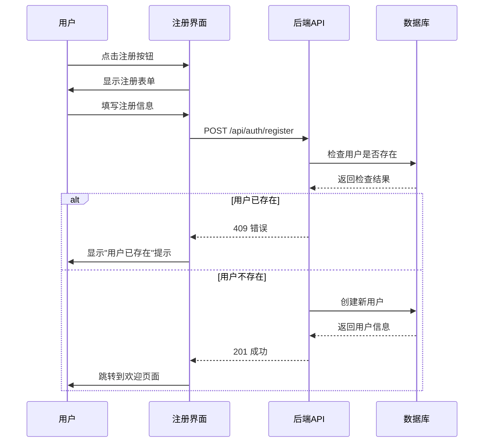
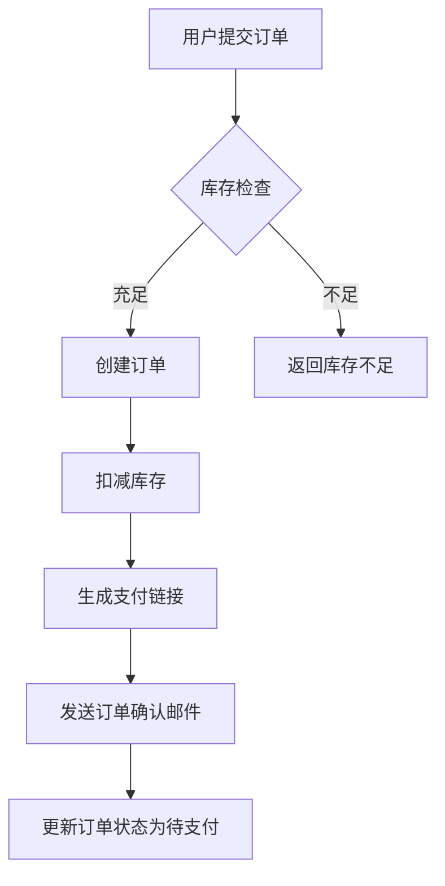
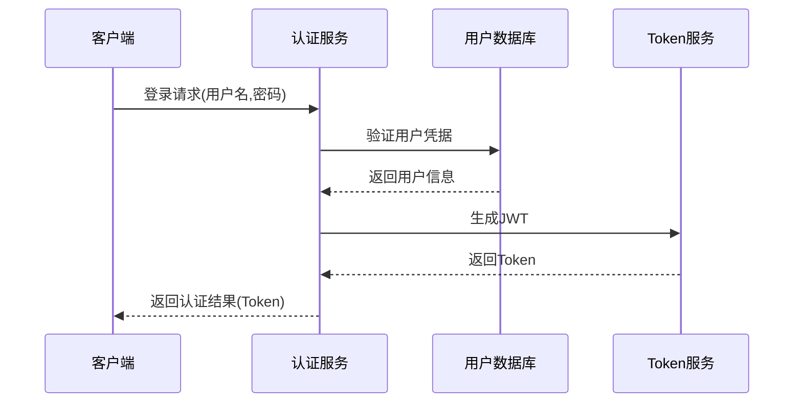
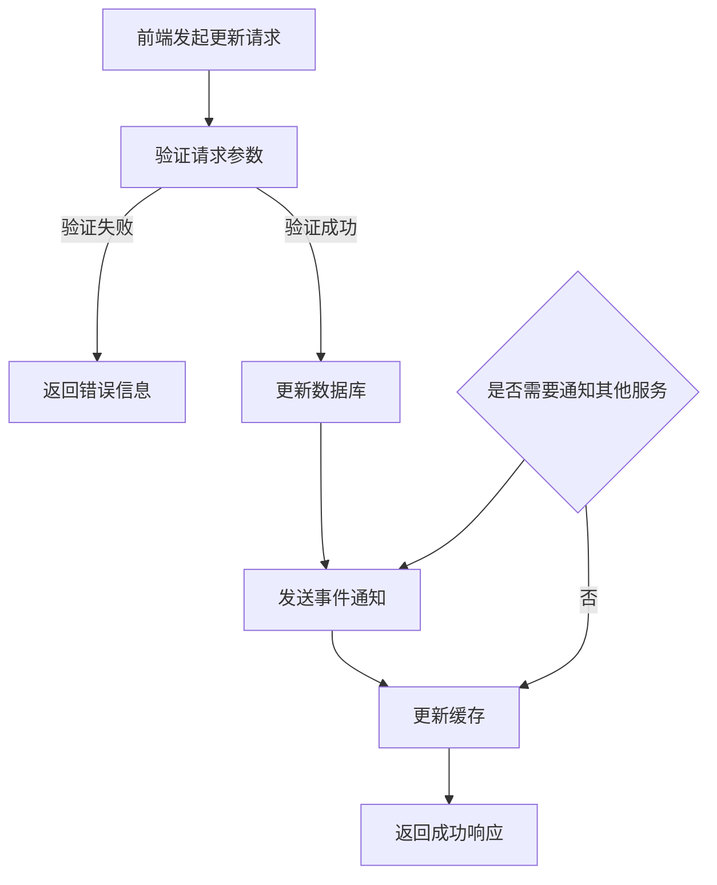
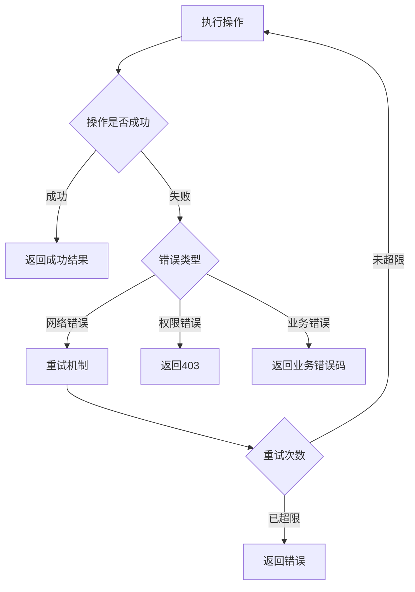
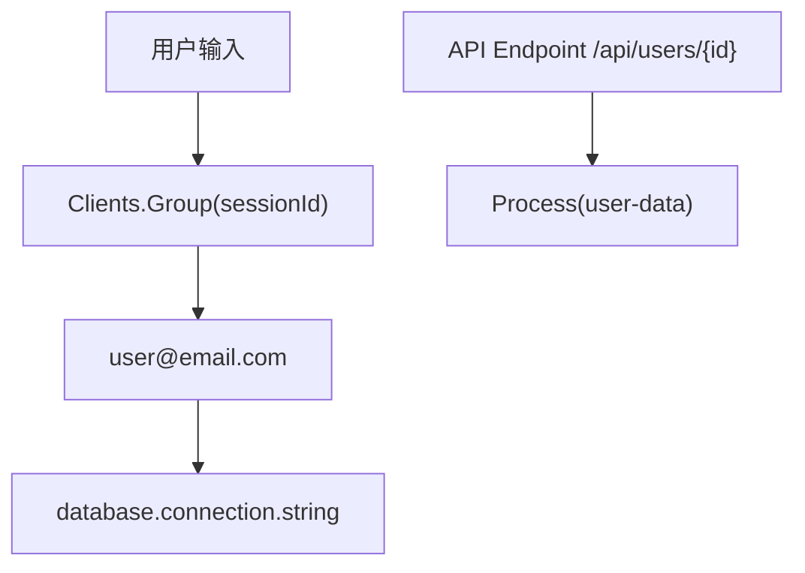
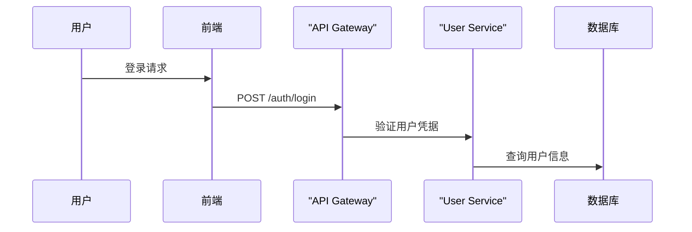
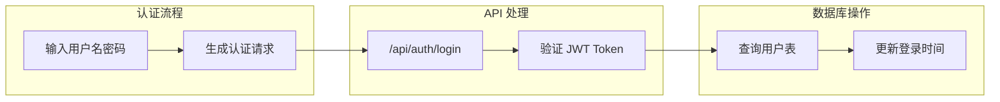

# OpenSpec 提案设计指南

本文档定义了在 OpenSpec 提案中包含设计可视化的标准和最佳实践。

## 概述

为了提高提案的可读性和审核效率，所有涉及 UI 设计和代码逻辑变更的提案都应包含相应的可视化图表。这些图表帮助审核者快速理解设计意图、交互流程和数据变化。

## UI 设计效果图要求

### 何时需要包含 UI 设计效果图

当提案涉及以下内容时，必须包含 UI 设计效果图：

1. **新增用户界面组件**
   - 新页面、新弹窗、新对话框
   - 新的表单或输入界面
   - 新的导航或菜单结构

2. **修改现有界面**
   - 重构现有页面的布局
   - 改变用户交互流程
   - 添加新的功能按钮或操作

3. **复杂的交互状态**
   - 多步骤操作流程
   - 条件显示的界面元素
   - 加载状态、错误状态、成功状态

### UI 设计效果图的格式要求

#### 1. ASCII 艺术图（推荐）

使用 ASCII 字符绘制界面原型，简单直接：

```markdown
### 用户登录界面

```
┌─────────────────────────────────────────┐
│ 用户登录                            [×] │
├─────────────────────────────────────────┤
│                                         │
│  邮箱地址 *                             │
│ ┌─────────────────────────────────────┐ │
│ │ user@example.com                   │ │
│ └─────────────────────────────────────┘ │
│                                         │
│  密码 *                                │
│ ┌─────────────────────────────────────┐ │
│ │ ••••••••••••••••••••••••••••••••  │ │
│ └─────────────────────────────────────┘ │
│                                         │
│ ☑ 记住我                              ☐ 忘记密码？  │
│                                         │
│            [登录] [注册账号]             │
└─────────────────────────────────────────┘
```

#### 2. Mermaid 图表（用于交互流程）

使用 Mermaid 描述用户交互流程：

```markdown
### 用户注册流程



#### 3. 状态说明

为每个界面元素标注状态：

```markdown
### 按钮状态设计

**正常状态**：
[登录] - 蓝色背景，白色文字

**悬停状态**：
[登录] - 深蓝色背景，白色文字，鼠标指针

**禁用状态**：
[登录...] - 灰色背景，灰色文字，加载动画

**错误状态**：
[登录] - 红色边框，下方显示错误提示
```

## 代码流程图要求

### 何时需要包含代码流程图

当提案涉及以下内容时，必须包含代码流程图：

1. **数据流变更**
   - 新的数据处理流程
   - 数据库操作变更
   - 缓存策略调整

2. **服务间交互**
   - 新增 API 调用链
   - 微服务通信变更
   - 事件驱动架构修改

3. **算法和业务逻辑**
   - 复杂的计算逻辑
   - 状态机变更
   - 决策流程修改

### 代码流程图的格式要求

#### 1. Mermaid 流程图

```markdown
### 订单处理流程



#### 2. 时序图

```markdown
### 用户认证时序图



#### 3. 代码变更表格

使用表格形式清晰列出所有涉及的代码文件和变更原因：

```markdown
### 代码变更清单

| 文件路径 | 变更类型 | 变更原因 | 影响范围 |
|---------|---------|---------|---------|
| `src/PCode.Domain/Models/Session.cs` | 新增属性 | 添加 ProposalName 属性用于存储AI生成的提案名称 | 数据模型 |
| `src/PCode.Application/SessionAppService.cs` | 新增方法 | 实现 GenerateProposalNameAsync 方法处理提案名称生成逻辑 | 应用层 |
| `src/PCode.Web/Controllers/SessionsController.cs` | 新增端点 | 添加 POST /api/sessions/{id}/generate-proposal-name API端点 | API层 |
| `src/PCode.Web/clientapp/src/components/SessionList.tsx` | UI修改 | 将单个新建按钮改为水平按钮组（新建对话/新建提案） | 前端UI |
| `src/PCode.Orleans/Grains/ClaudeCodeGrain.cs` | 新增方法 | 添加 GenerateProposalNameAsync 方法调用Claude生成提案名称 | Orleans层 |
| `src/PCode.EntityFrameworkCore/Migrations/xxx_AddProposalName.cs` | 数据库迁移 | 在 Sessions 表中添加 ProposalName 列 | 数据库 |

**变更类型说明**：
- **新增**：全新的文件或功能
- **修改**：在现有基础上添加或调整功能
- **删除**：移除不再需要的功能
- **重构**：重新组织代码结构但不改变功能
```

对于复杂的文件变更，可以使用嵌套表格展示更详细的信息：

```markdown
### 详细变更 - SessionList.tsx

| 组件/方法 | 变更前 | 变更后 | 变更原因 |
|----------|-------|-------|---------|
| Button组件 | `<Button onClick={handleCreateSession}>新建</Button>` | `<ButtonGroup><Button onClick={handleCreateChat}>新建对话</Button><Button variant="secondary" onClick={handleCreateProposal}>新建提案</Button></ButtonGroup>` | 支持创建不同类型的会话 |
| handleCreateSession方法 | 统一创建聊天会话 | 拆分为 handleCreateChat 和 handleCreateProposal 两个方法 | 分别处理不同会话类型的创建逻辑 |
| State管理 | 单个loading状态 | chatLoading 和 proposalLoading 两个独立状态 | 独立控制不同按钮的加载状态 |

### 详细变更 - SessionsController.cs

| 方法/属性 | 变更类型 | 具体变更 | 变更原因 |
|----------|---------|---------|---------|
| GenerateProposalName | 新增方法 | `public async Task<ActionResult<string>> GenerateProposalName(Guid sessionId)` | 处理提案名称生成请求 |
| 参数验证 | 新增 | 验证会话类型必须是 proposal | 确保只有提案会话才能生成名称 |
| 异常处理 | 新增 | 添加 400/409/500 错误响应 | 提供清晰的错误信息给客户端 |
```

## 最佳实践

### 1. 图表命名规范

- 使用清晰的标题说明图表内容
- 为每个图表添加简要说明
- 使用编号组织多个图表

### 2. 注释和说明

```markdown
### 数据更新流程



**说明**：
- 所有数据库操作都在事务中执行
- 事件通知使用异步队列，不阻塞主流程
- 缓存更新采用写穿透策略
```

### 3. 错误处理流程

```markdown
### 错误处理流程图


```

## 集成到提案模板

### proposal.md 模板更新

```markdown
# Change: [变更标题]

## Why
[问题描述和变更原因]

## What Changes
- [变更列表]
- [标记破坏性变更]

## UI 设计变更

### 新增界面
[如果涉及 UI 变更，在此添加 ASCII 设计图和 Mermaid 流程图]

### 界面交互流程
[使用 Mermaid sequence diagram 描述用户交互]

## 代码流程变更

### 数据流图
[使用 Mermaid flowchart 描述新的数据流程]

### 组件交互图
[使用 Mermaid graph 描述组件间的交互]

### 代码变更清单
[使用表格列出所有涉及的代码变更]

| 文件路径 | 变更类型 | 变更原因 | 影响范围 |
|---------|---------|---------|---------|
|         |         |         |         |

## Impact
[影响分析]
```

### design.md 模板更新

```markdown
# Design: [设计文档标题]

## Overview
[设计概述]

## UI/UX Design

### 界面设计
[详细的 UI 设计图和说明]

### 交互流程
[用户操作流程的时序图]

## 技术设计

### 架构图
[系统架构的 Mermaid 图]

### 数据流
[数据处理的流程图]

### API 设计
[API 调用时序图]

### 详细代码变更

#### 后端变更
| 文件路径 | 变更类型 | 变更说明 | 影响模块 |
|---------|---------|---------|---------|
|         |         |         |         |

#### 前端变更
| 文件路径 | 变更类型 | 变更说明 | 影响组件 |
|---------|---------|---------|---------|
|         |         |         |         |

#### 数据库变更
| 对象/表 | 变更类型 | 变更说明 | 影响字段 |
|---------|---------|---------|---------|
|         |         |         |         |

## 实现细节

### 关键代码片段
[展示重要的代码变更示例]

### 配置变更
[列出所有配置文件的变更]

## 测试策略
[说明如何测试这些变更]
```

## 工具和资源

### 推荐的图表工具

1. **Mermaid 编辑器**
   - 在线编辑器：https://mermaid.live
   - VS Code 插件：Mermaid Preview
   - 支持：流程图、时序图、类图等

2. **ASCII 艺术工具**
   - ASCII art generator：https://patorjk.com/software/taag
   - Draw ASCII：https://ascii.co.cn/art

3. **图表语法参考**
   - Mermaid 文档：https://mermaid-js.github.io/mermaid
   - PlantUML：https://plantuml.com

### Mermaid 语法最佳实践

当在 Markdown 文件中编写 Mermaid 图表时，请注意以下语法规范：

#### 节点标签中的特殊字符处理

**重要**：对于包含特殊字符（括号、方括号、点号）的节点标签，必须使用双引号包裹：



**常用特殊字符列表**：
- 括号：`(` `)` `{` `}` `[` `]`
- 斜杠：`/` `\`
- 点号：`.`
- 空格
- 特殊符号：`@` `#` `$` `%` `^` `&` `*`

#### 推荐的命名规范



#### 复杂表达式的处理

对于包含复杂表达式或路径的节点，建议：

1. 使用简化的标识符
2. 在图例或说明中解释完整含义
3. 考虑使用子图分组相关节点



### 审核清单

在提交提案前，请确认：

- [ ] 如果涉及 UI 变更，是否包含了所有界面的设计图？
- [ ] 如果涉及代码逻辑变更，是否包含了数据流图？
- [ ] 所有图表都有清晰的标题和说明？
- [ ] 图表中的关键路径都有标注？
- [ ] 错误处理流程是否已经图示化？
- [ ] 组件间的交互关系是否清晰？
- [ ] 是否包含了完整的代码变更表格？
- [ ] 代码变更表格中的文件路径是否正确？
- [ ] 每个变更的原因和影响范围是否清晰说明？
- [ ] 对于复杂变更，是否有详细的变更前后对比？

## 示例提案

参考 [add-proposal-session-name](/changes/add-proposal-session-name/design.md) 变更中的完整设计文档示例，其中包含了：
- 详细的 UI 设计图（ASCII 格式）
- 用户交互流程（Mermaid 时序图）
- 组件架构图
- 数据流图
- 错误处理 UX 设计

## 维护指南

1. **定期更新**：随着项目发展，定期审查和更新本指南
2. **收集反馈**：从审核者那里收集关于图表质量的反馈
3. **模板改进**：根据实际使用情况改进提案模板
4. **培训资源**：为团队成员提供 Mermaid 和 ASCII 艺术的培训资源

---

记住：好的可视化设计能够显著提高提案的审核效率，减少沟通成本，确保所有参与者对变更有一致的理解。