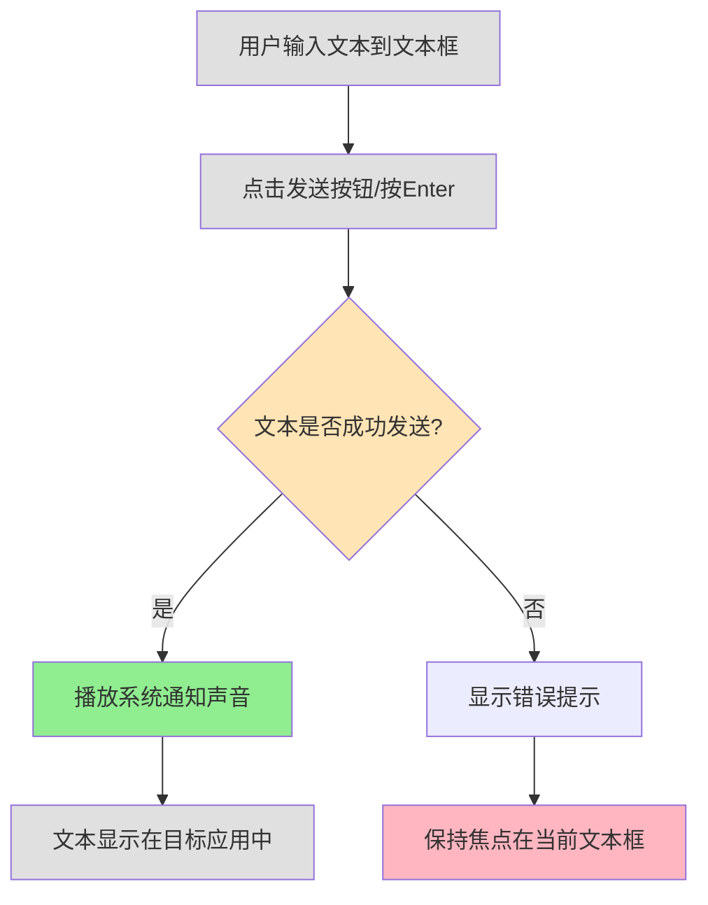

# Change: Add Sound Notifications for Text Sent Events

## Why
Users want audio feedback when text is successfully sent to the target application, providing immediate confirmation without relying on visual notifications that appear in the system tray.

## What Changes
- Extend the existing `NotificationAdapter` base class to support sound playback
- Implement platform-specific sound playback for Windows, macOS, and Linux
- Integrate sound notification trigger after successful text sending operations
- Use built-in system notification sounds (no external audio files required)
- Ensure cross-platform compatibility using the existing platform abstraction layer

## Interaction Flow

## Impact
- Affected specs: New capability `notifications` will be created
- Affected code:
  - `src/platform_adapters/base.py` - Add sound methods to NotificationAdapter
  - `src/platform_adapters/*/adapter.py` - Implement platform-specific sound playback
  - `src/remote_server.py` - Integrate sound notification trigger